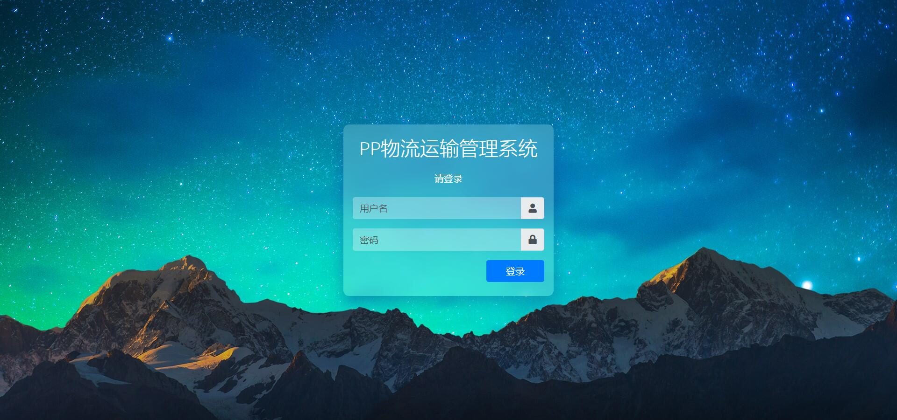
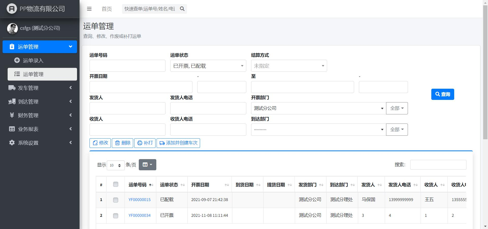
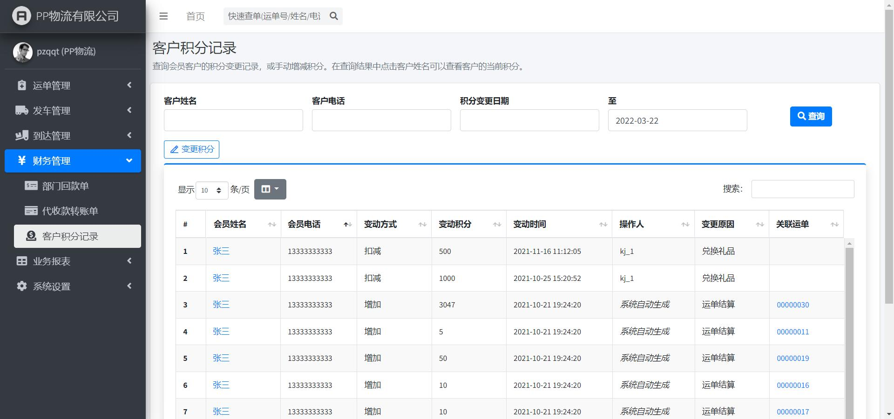

# Django Transportation Management System

A logistics management system (TMS, Transportation Management System) implemented with Django.

## Features

- Frontend based on Bootstrap 4 and AdminLTE frameworks.
- Uses MySQL as the database backend.
- Implements basic functions such as waybill entry, vehicle dispatch, arrival receipt, and customer receipt.
- Includes comprehensive reporting and financial management features.
- User permissions can be managed through the admin interface.

## Limitations

- The project does not use frontend-backend separation, as I didn't recognize the trend at the time. It was originally intended as a portfolio project for job hunting.
- Since it was written as a practice project while learning, there are no historical commits, but I kept hundreds of backup versions.
- Due to lack of knowledge, I reinvented many wheels.
- Due to lack of time (and laziness), there is no user documentation.

## TODO

- Implement printing of cargo labels and delivery notes (requires a printing control).
- Implement messaging functionality.

## Dependencies

- Minimum required Python version: v3.9+
- Required third-party libraries:
  - django
  - mysqlclient
  - openpyxl (for report export functionality)
- Optional third-party libraries:
  - django-debug-toolbar (for debugging)
  - django-extensions (to enhance `manage.py` functionality)

## Usage

- Clone the repository.
- Install and configure MySQL (not detailed here).
- Change directory to the project folder.
- Synchronize AdminLTE-3.0.5:
  - Run `git submodule init`
  - Run `git submodule update --depth=1`
- Edit `PPWuliu/settings.py` and manually configure the following:
  - SECRET_KEY
  - DATABASES
- Manually create the database (the database name should match the one configured in `DATABASES` in `PPWuliu/settings.py`).
- Import test data: run `init_database.sh` (see this file for test account credentials).
> Note: It is not possible to run this shell script in a Windows environment (even using mingw64 from Git For Windows will fail after `git apply` with no error message). If you must run this project on Windows, please read `init_database.sh` and execute the commands manually.
- Run `manage.py runserver`
- The Django admin backend is enabled by default; please create a superuser yourself.

## Preview

